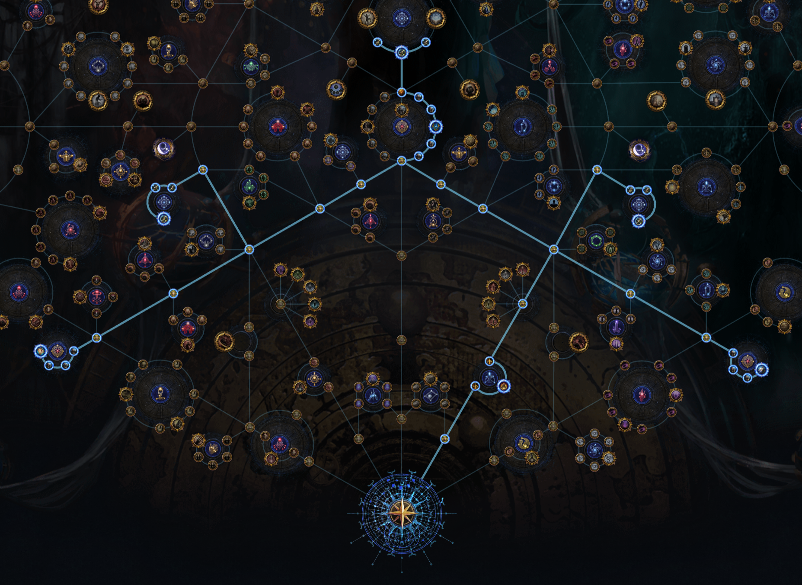

# Appendix A. Atlas Skill Tree

Once you have completed the campaign you unlock end-game content: **Maps.**  On PC the hotkey is `G`.

As you complete maps you earn **Atlas Skill Tree points.**  On PC the hotkey is `Ctrl`-`G`.

Your [first atlas skill tree](https://poeplanner.com/atlas-tree/BAASACkAH8qH1F8-QL-n4iFgtWY4iH1ajerZWxe6HX23XX2ROJ3e_p87Tdee2AKuKY1Fl0U6s8fhELxJtXdzmaLQxB-u75GJYMgYiwtxqUPjP41kb7WZuRQAH4sIAAAAAAAAAwMAAAAAAAAAAAA=) should be focused on unlocking [Kirac Missions](https://www.poewiki.net/wiki/Commander_Kirac) so you can sustain maps. That is, when you run a map there will be a higher chance for mobs to drop a map.  This way you don't have to buy maps from other players.

* 

|Quality| Node                         |
|------:|:-----------------------------|
|     1 | Adjacent Map Drop Chance     |
|     2 | Delve Mission Chance         |
|     3 | Frantic Mining               |
|     4 | Delve Mission Chance         |
|     5 | Adjacent Map Drop Chance     |
|     6 | Adjacent Map Drop Chance     |
|     7 | Adjacent Map Drop Chance     |
|     8 | Adjacent Map Drop Chance     |
|     9 | Adjacent Map Drop Chance     |
|    10 | Kirac Mission Chance         |
|    11 | Kirac Mission Chance         |
|    12 | Expect the Unexpected        |
|    13 | Kirac Mission Chance         |
|    14 | Kirac Mission Chance         |
|    15 | Scarab Drop Chance           |
|    16 | Commision Officer            |
|    17 | Shaping the World            |
|    18 | Higher Map Tier Chance       |
|    19 | Higher Map Tier Chance       |
|    20 | Overloaded Circuit           |
|    21 | Higher Map Tier Chance       |
|    22 | Higher Map Tier Chance       |
|    23 | Higher Map Tier Chance       |
|    -- | --- Right Side of Atlas ---  |
|    24 | Adjacent Map Drop Chance     |
|    25 | Adjacent Map Drop Chance     |
|    26 | Kirac Mission Chance         |
|    27 | Kirac Mission Chance         |
|    28 | Kirac Mission Chance         |
|    -- | --- Left Side of Atlas ---   |
|    29 | Adjacent Map Drop Chance     |
|    30 | Adjacent Map Drop Chance     |
|    31 | Adjacent Map Drop Chance     |
|    32 | Adjacent Map Drop Chance     |
|    33 | Adjacent Map Drop Chance     |
|    34 | Kirac Mission Chance         |
|    35 | Kirac Mission Chance         |
|    36 | Kirac Mission Chance         |
|    37 | Planar Tactician             |
|    -- | --- Right Side of Atlas ---  |
|    38 | Adjacent Map Drop Chance     |
|    39 | Higher Map Tier Chance       |
|    40 | Higher Map Tier Chance       |
|    41 | Shaping The Mountains        |
|    -- | --- Left Side of Atlas ---   |
|    42 | Adjacent Map Drop Chance     |
|    43 | Higher Map Tier Chance       |
|    44 | Higher Map Tier Chance       |
|    45 | Shaping The Skiesains        |

Sirgog has a good video:

* [POE 3.25 Atlas + Build = Currency. 26 Paths To Get Rich In Settlers of Kalguur Path Of Exile](https://www.youtube.com/watch?v=4m7_uyZy3yc&t=250s)

* **On Atlas:** Additional map content: Blight
* **Off Atlas:** Delve, Heist, Lab, and Pinnacle Bosses.

---

Prev: [4. Maps](maps.md)
Home: [Table of Contents](readme.md)
Next: [Appendix B. Build Guide](appendix_b_build_guide.md)
