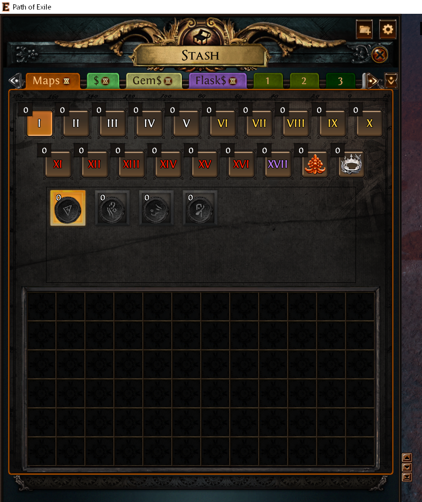

# 4 Maps

So now that you have beaten the campaign what now?

PoE has end-game content called [Atlas of Worlds](https://www.poewiki.net/wiki/Atlas_of_Worlds).  They are procedural generated content using existing zones tilesets and bosses from the campaign.

For example the [Siege Map](https://www.poewiki.net/wiki/Siege_Map) re-uses:

* tilesesets from [The Ravaged Square](https://www.poewiki.net/wiki/The_Ravaged_Square) in Act 10, and
* the boss [Tukohama, Karui God of War](https://www.poewiki.net/wiki/Tukohama,_Karui_God_of_War) from Act 6.

Maps are grouped into Tiers by difficulty. Tier 1 is easiest with Tier 17 the hargest.

## 4.0 White, Yellow, Red, and Purple Maps

You may see or hear people talk about White, Yellow, Red, or Purple maps.  If you have the [premium stash tab](https://www.pathofexile.com/shop/category/stash-tabs) ...

... you will notice that the _Map Stash Tab_ has Tiers 1 - 17 color-coded:

|Difficulty |Color   |
|:----------|:-------|
|Tiers 1-5  | White  |
|Tiers 6-10 | Yellow |
|Tiers 11-16| Red    |
|Tiers 17   | Purple |

/!\ You can tell if a map has been completed if there is a **white line below the map folder icon.**

When viewing a map in your or Kirac' inventory hold down `Alt` to see if you have completed that map.

* Green = Completed
* Red = Incomplete

You will see the state of:

* Atlas Map
* Bonus Objective

## 4.1 Map Modifiers to avoid

THere are certain map modifiers you should avoid:

* Players have #% Less Recovery Rate of Life and Energy Shield

This will lower your life regeneration rate and you won't be able to sustain RF.

Also see:

* Pohx has a video called [PoE 3.25 - What to do after the Campaign](https://www.youtube.com/watch?v=ZLdJdRGQtJs)

---

Prev: [4.10 Act 10](act10.md)
Home: [Table of Contents](README.md)
Next: [4.1 Tier 1](maps_t1.md)
